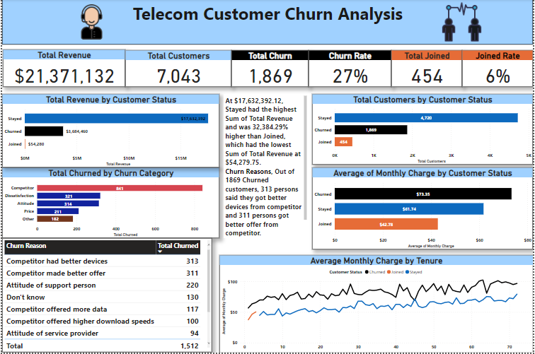
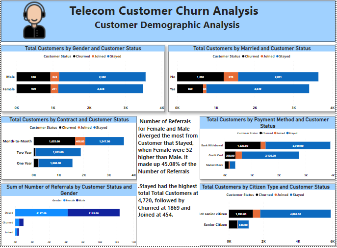
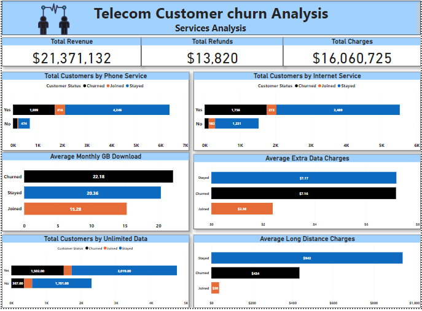

# Telecommunication Customer Churn Analysis

in this Project, I am working with the management of Maven Telecommunications Company using PowerBi to to perform data exploration and uncover key metrics.

## Introduction

For this project, I took the role of BI analyst to solve a telecommunication business problem by investigating the customer churn rate and offer valuable insights to reduce the rate. I used PowerBi and wrote DAX to perform data exploration and uncover key metrics.As the Data Analyst, I was directed by the CMO of Maven Telecommunication company, a fictitious manufacturing company to analyze the sales  data of the company . He wants to keep an eye on the company’s Internal performance 

## Business Problem

###In this Project, I am working with the management of Maven Telecommunications Company using PowerBi to provide insight on:

1. How many customers joined the company during the last quarter? How many customers joined?

2. What is the customer profile for a customer that churned, joined, and stayed? Are they different?

3. What seem to be the key drivers of customer churn?

4. Is the company losing high value customers? If so, how can they retain them?

## The processes I took in other to provide answers to the above questions are:
* Read Through the requirment properly
* Cleaned the data using Power Query and merging necessary tables to overcome ambuguity.
* Created relationships; data modeling 
* Wrote few DAX to answer questions 
* Designed my dashboard with the reports and most important metrics.

## PowerBI Interactive Dashboard Created for the Analysis

## The Customer Analysis Dashboard : This provides information about Customer's gender, marital status, Payment method E.T.C

## Service Analysis Dashboard provives a detailed analysis on the servives subscribed to by the customers.

## Summary of Findings

## How many customers joined the company during the last quarter? How many customers joined?

Maven Telecommunications made $21,371,132 and have 7,043 customers. 454 of those customers Joined , the total revenue generated from these people is $54,280. Their average monthly charges is $42.78.

## What is the customer profile for a customer that churned, joined, and stayed? Are they different?
### Churned Customers profile

There are 7,043, 1,869 0f those customers have churned, this resulted in roughly a 27% churned rate for telecom company. The revenue generated from customers that churned is $3.7 Million, which is 17.2% of the entire revenue. Their average monthly charge is $73.53 which is the highest.
Out of the 5,517 customers that subscribed to internet services, 1,756 of those customers have churned, a rate of 31.8%, while 1,699 out 6,361 that subscribed to phone services have churned, this resulted in a 26.7% churned rate.

### Stayed Customers Profile
Out of 7,043 Customers, 3,489 Customers stayed, resulting in a 67.0% stayed rate. The revenue generated from customers that stayed is $ 17.7 million, which is 82.5% of the entire revenue generated. Their average monthly payment is $61.74, which is $11.99 lower than what customer that churned were charged.
3,489 customers out of the 5,517 customers that subscribed to internet services, stayed, a rate of 63.2, while 4,2,46 out of 6,361 subscribed to phone services. A rate of 66..8%

## What seem to be the key drivers of customer churn?
The key factor for customer churn is average monthly payment. Customers that churned are charged $73.53. They pay $11.99 more than customers who stayed and $30.75 more than newly joined customers.
A couple of customers churned because they got better devices from competitors , better offers and bad attitude from support person.

## Is the company losing high value customers? If so, how can they retain them?

Customers who stayed generated the most revenue , they subscribed the most for phone service and internet service, they pay the most for unlimited data , average extra data and average long distance etc.. Customers who stayed are the high value customers. However, working toward decreasing the churn rate would help the company as the Customers who churned are also high value customers.

## Recommendation.
In order to decrease churn rate, key drivers for churn would be high monthly payments and improving customer support. 17% of customers leave due to Competitors making better offers. There should be more of an effort to make monthly payments reasonable and using offers is one effective way to lower cost and convincing customers to stay. The 3rd highest reason customers stated for leaving was the Attitude of the support person (12%), only outmatched by competitor products and prices. The customer support should be extremely high to keep the customers happy. No customer will be loyal to a company who do not provide great customer service. Addressing the customer support team and the customer support process will allow help secure customer loyalty from the inside out.
Additionally, company should address the month-month contrast, It is most likely people leave when they sigh for the month-month contrast. They can work on improving the offer of one and two year contract to make them better deals for the customers. It is advisable to cancel month-month contract, change It to a 3 month or 6 month contract.
Overall, Telecom should look to do what is right for their customers. Lowering prices and providing offers, especially for your tenured customers, would go along way. It would be best to address some in-house processes like customer support and contract options to increase customer loyalty all around.

